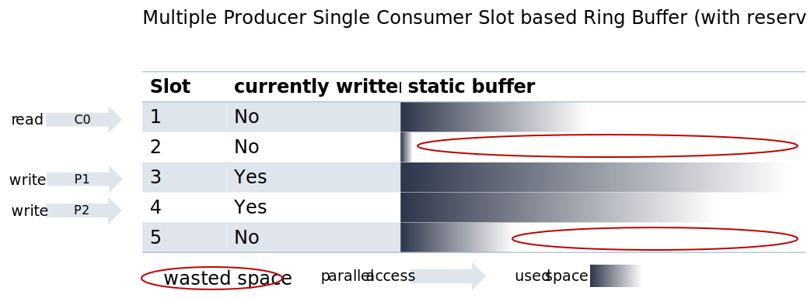

# Detailed Design

## Design Decisions

- Exclude dependencies to adaptive AUTOSAR Stack
- Object-Seam way for mocking (no link-time mocking)
- No dynamic memory allocation as end goal (but there will still be dynamic memory allocation in _one_ particular location when the remote backend is involved)
- Faster & more Efficient
- APIs as free Functions - to support existing users that have been reliant on adaptive AUTOSAR standard that clearly forces free functions. Thus, the abstraction is not straight forward and needs to be split into two parts. A not mockable and a mockable part.
- C++ mainly uses [streams](https://en.cppreference.com/w/cpp/io) to perform input and output operations. Hence a similar pattern is used here to provide a consistent interface for the general C++ user. Although function-based logging could seem better; in order to optimally use the [DLT protocol](#dlt-formatted-payload) (which is our main backend), a stream based approach has clear benefits.

## Design

The core design is based on a slot oriented lock-free ringbuffer, where each slot can be marked as
currently used. This kind of data structure is illustrated in the following graphic:



The goal is to create slots that allow individual writing and reading simultaneously. The reader can determine
whether they can continue or not by checking a flag indicating if the slot has been written to. If each slot is
filled, the writer will - like in a normal ring buffer - wrap around. This data structure includes multiple
ideas that are important in the context of logging.

First, the buffer size (per slot and the number of slots) is allocated at creation time. This will ensure that no
dynamic memory will be allocated during runtime. Which will improve speed as also it fulfills our safety requirements.

Second, it allows multiple writes at the same time, without requiring that the start / stop in a synchronized manner.
This is particularly important for use cases such as nested log messages.

```
LogError() << "My message:" << func();


int func() {
    LogError() << "My nested message";
    return 1;
}
```

It is important to understand that even within a single thread, one message can start being written, then another message can be started and finished, before going back to complete the first message. Locking the global data structure for each stream could cause a deadlock.

Additionally, because the system does not use locks, multiple threads can write to the data structure at the same time.

A choice has been made to prioritize stable performance over using less memory, which means the system is designed to be lock-free and does not use dynamic memory.

While the idea of lock-free data structures is not new, the specific rules for this data structure may be unique, and there is scope for further improvements.

Starting from this basic idea, the static design is divided into four main parts:

1. `Formatter`
   Support different kind of logging formats. The most major one is the [DLT format](<broken_link_g/swh/ddad_platform/blob/master/aas/mw/log/README.md#dlt-formatted-payload>).
   Another one is the raw format (no special formatting applied). A future extension with other formats will be easy,
   separating this concern from the others mentioned below.
2. `Backend`
   This represents the place where the system will store the logging messages, send them to other processes, or
   take any other applicable action. The main idea is that any user can ask to reserve a slot, then get the memory
   address of that slot and then again notify that the writing to the slot has been finished. Basically
   the `Backend` abstracts the data structure that was previously described.
3. `Recorder`
   In any case, the end-user will always expect a combination of `Formatter` and `Backend`. e.g. it does not make sense
   to send raw formatted streams via DLT. But it could make sense to store DLT-formatted messages in a file. So
   a `Recorder` encapsulates a combination of `Formatter` and `Backend` for a user.
4. `LogStream`
   Is the real user facing API. While theoretically it could also make sense that a user directly access a recorder, it
   makes more sense to provide a RAII pattern from the user to easily interact with the logging API. This is exactly done by the
   `LogStream`. Upon creation, a slot will be reserved and is _owned_ by the `LogStream`. Upon destruction, the
   respective slot will be made available again.

This design allows that any content streamed by the user into a `LogStream`, will directly end up in the respective slot
implementation.


### Types of recorders

Following recorders are supported:
1. DataRouterRecorder - which enables remote logging, which is the most common.
2. TextRecorder - which enables logging to a text based backend (e.g. console, or system backend).
3. FileRecorder - which enables logging to the file.
4. CompositeRecorder - which may combine multiple logging modes mentioned above, what means that enables logging
   to e.g. console and file in parallel.
5. EmptyRecoder - used when logging is off.
Because of the similarity between TextRecorder and FileRecorder it is decided to use the common Backend for both.


### High Level Component Diagram - Remote Logging


### Activity diagrams


### User-Facing APIs

The `LogStream` serves as the user-facing API for streaming content into the buffers. However creating
this `LogStream` can be a little tricky, because it requires the correct `Recorder` to be injected.
To avoid complicating the process for users in typical scenarios, `LogStream` can only be created through the factory method.
The factory method could be invoked by the user, but is in a respective implementation specific
namespace. At the end, the user will be either able to create a `LogStream` via our free-functions or a context aware logger.
At the end it shall be noted, that the ownership of the `LogStream` is transferred from the middleware to the user,
which is why these calls must be performed by value and not interface is possible at that point in time.
This transfer of ownership is important, since otherwise further dynamic memory allocation would be necessary.

## Library Dependencies

A comprehensive list of library dependencies for mw::log can be queried using bazel via:
`bazel query 'kind("cc_library", deps(//platform/aas/mw/log))'`
