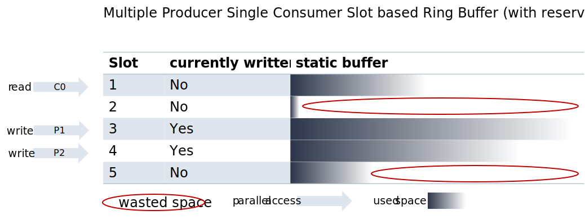

# Detailed Design

## Table of Contents

- [Design Decisions](#design-decisions)
- [Design](#design)
  - [Core Data Structure](#core-data-structure)
  - [Architectural Components](#architectural-components)
  - [Types of Recorders](#types-of-recorders)
  - [Backend Registration System](#backend-registration-system)
  - [Activity Diagrams](#activity-diagrams)
  - [User-Facing APIs](#user-facing-apis)
  - [Configuration](#configuration)
  - [Runtime](#runtime)
- [Library Dependencies](#library-dependencies)
- [Related Design Documents](#related-design-documents)

## Design Decisions

- Object-seam mocking — The codebase uses object seams for testability (no link-time mocking). All recorder and backend abstractions expose virtual interfaces with corresponding mock implementations.
- No dynamic memory allocation at runtime — Buffer sizes (per slot and number of slots) are allocated at creation time. The sole exception is the remote backend (`DataRouterRecorder`), which requires one dynamic allocation for shared-memory communication.
- Lock-free, pre-allocated buffers — The system prioritises stable, predictable performance over memory efficiency by using lock-free data structures with pre-allocated storage.
- Stream-based API — C++ idiomatically uses [streams](https://en.cppreference.com/w/cpp/io) for I/O. The `LogStream` follows this pattern to provide a familiar interface and to efficiently support the [DLT protocol](../README.md#dlt-formatted-payload), which is the primary backend format.
- Free-function and context-aware entry points — Two complementary APIs coexist: free functions (`LogError()`, `LogWarn()`, …) for convenience, and a `Logger` class for context-aware logging. The free functions satisfy compatibility with the Adaptive AUTOSAR standard, while the `Logger` provides scoped context identifiers.
- Plugin-based backend selection — Backends register themselves via static initialisation into a global function-pointer table (`BackendTable`). Applications opt in to specific backends through Bazel dependencies, and the `RegistryAwareRecorderFactory` queries the table at runtime to compose the active recorder.

## Design

### Core Data Structure

The core data structure is a slot-oriented, lock-free ring buffer where each slot carries a flag indicating whether it is currently in use. The following graphic illustrates this layout:



The `CircularAllocator` template (in `detail/circular_allocator.h`) implements this ring buffer. Each slot allows independent, concurrent writing and reading. A reader checks the slot's flag to determine readability; when every slot is occupied, the writer wraps around like a conventional ring buffer.

Key properties:

- No runtime allocation. The buffer capacity — both per-slot size and total slot count — is fixed at construction time. This satisfies safety requirements and eliminates allocator overhead on the hot path.
- Concurrent and nested writes. Multiple threads can write simultaneously without synchronisation. Within a single thread, nested log messages are also safe, because each `LogStream` instance acquires its own slot independently.

```cpp
LogError() << "My message:" << func();

int func() {
    LogError() << "My nested message";
    return 1;
}
```

In this example, the outer message starts writing, then the inner message acquires a separate slot, completes, and releases it — all before the outer message finishes. A locking approach would deadlock here; the lock-free design avoids that.

### Architectural Components

The static design is divided into five main parts:

1. MessageBuilder / Format
   Responsible for encoding log data into a target wire format. Two format families exist:
   - `DLTFormat` / `DltMessageBuilder` — Encodes payloads in the [DLT protocol](../README.md#dlt-formatted-payload) format, used by the remote and file recorders.
   - `TextFormat` / `TextMessageBuilder` — Produces human-readable text output, used by the console recorder.

   The `IMessageBuilder` interface (in `detail/text_recorder/imessage_builder.h`) defines the abstraction, allowing new formats to be introduced without affecting other components.

2. Backend
   Abstracts the storage and transport of log data. A `Backend` (defined in `detail/backend.h`) manages slot allocation and flushing. Concrete implementations include:
   - `DataRouterBackend` — Transmits log entries to the DataRouter via shared memory for remote DLT logging.
   - `FileOutputBackend` — Writes log entries to local files.
   - `SlogBackend` — Forwards log entries to the QNX `slog2` system logger (QNX-only).

   The `Backend` exposes three key operations: `ReserveSlot()`, `FlushSlot()`, and `GetLogRecord()`.

3. Recorder
   Combines a message builder with a backend into a single coherent unit. The base class `Recorder` (in `recorder.h`) defines pure-virtual `Log()` overloads for all supported C++ primitive types, plus `StartRecord()` and `StopRecord()` for slot lifecycle management.

4. LogStream
   The primary user-facing API. `LogStream` is a RAII wrapper: construction acquires a slot from the active recorder, and destruction releases it. Content streamed via `operator<<` writes directly into the owned slot, avoiding intermediate copies. Ownership transfers from the middleware to the caller by value — no heap allocation is required.

5. RecorderFactory
   The `RegistryAwareRecorderFactory` (in `detail/registry_aware_recorder_factory.h`) is the single implementation of `IRecorderFactory`. It queries the `BackendTable` for registered backends, creates the appropriate recorders, and composes them via `CompositeRecorder` when multiple log modes are active.


### Types of Recorders

The following concrete `Recorder` implementations exist:

| Recorder | Purpose | Backend / Transport |
|---|---|---|
| `DataRouterRecorder` | Remote DLT logging via DataRouter shared memory | `DataRouterBackend` |
| `TextRecorder` | Human-readable text output (console, system logger) | `FileOutputBackend` / stdout |
| `FileRecorder` | DLT-formatted file logging | DLT file writer |
| `CompositeRecorder` | Multiplexes log entries to one or more child recorders | Delegates to children |
| `EmptyRecorder` | No-op stub for when logging is disabled | None |

`CompositeRecorder` enables parallel logging to multiple sinks — for example, console and remote DLT simultaneously. It implements the composite design pattern: each `Recorder` method delegates to all child recorders in sequence.

`EmptyRecorder` serves as the default when no backend is linked or when logging is explicitly turned off.


### Backend Registration System

Backends use a static plugin architecture. Each backend provides a *registrant* — a compilation unit containing a `BackendRegistrant` static object that self-registers a creator function into the global `BackendTable` during static initialisation.

The `BackendTable` (in `backend_table.h`) maintains a fixed-size array of `RecorderCreatorFn` function pointers, indexed by `LogMode`:

| `LogMode` | Slot | Registrant |
|---|---|---|
| `kConsole` | 0 | `console_registrant.cpp` |
| `kFile` | 1 | `file_registrant.cpp` |
| `kRemote` | 2 | `remote_registrant.cpp` |
| `kSystem` | 3 | `slog_registrant.cpp` (QNX only) |
| `kCustom` | 4 | `custom_registrant.cpp` |

At runtime, `RegistryAwareRecorderFactory` queries `IsBackendAvailable()` for each configured log mode and calls `CreateRecorderForMode()` for available backends. If a requested backend is not linked, the factory falls back to console logging; if console is also unavailable, it falls back to the `EmptyRecorder` stub.

Each registrant Bazel target uses `alwayslink = True` to ensure the linker does not discard the static registrant object.


For a step-by-step guide on adding a new backend, refer to [registry_aware_recorder_factory.md](./registry_aware_recorder_factory.md).

### Activity Diagrams


### User-Facing APIs

Users interact with the logging library through two complementary entry points:

#### Free Functions

The free functions in `logging.h` provide the simplest way to emit log messages. Each function returns a `LogStream` by value:

```cpp
#include "score/mw/log/logging.h"

score::mw::log::LogError() << "Something went wrong: " << error_code;
score::mw::log::LogInfo("MYCTX") << "Startup complete";
```

Available functions: `LogFatal()`, `LogError()`, `LogWarn()`, `LogInfo()`, `LogDebug()`, `LogVerbose()`. Each accepts an optional `std::string_view context_id`; when omitted, the default configured context identifier is used.

#### Context-Aware Logger

The `Logger` class (in `logger.h`) binds a context identifier at construction time and exposes the same log-level methods:

```cpp
#include "score/mw/log/logger.h"

score::mw::log::Logger logger{"MYCTX"};
logger.LogError() << "Context-scoped error";
```

`Logger` also provides `WithLevel(LogLevel)` for dynamic log-level selection and `IsEnabled(LogLevel)` / `IsLogEnabled(LogLevel)` for checking whether a given level is active before constructing an expensive message.

#### Ownership Model

Both free functions and `Logger` methods return `LogStream` by value. Ownership transfers from the middleware to the caller. The `LogStream` acquires a slot on construction and releases it on destruction (RAII). No heap allocation occurs during this transfer.

### Configuration

The logging library loads its configuration lazily on the first log call. For verbose logging, two configuration files are consulted:

1. ECU-wide configuration — `/etc/ecu_logging_config.json` — provides the ECU identifier (`ECUID`) used in DLT headers.
2. Application-specific configuration — discovered via the `MW_LOG_CONFIG_FILE` environment variable, or from standard paths (`/opt/<app>/etc/logging.json`, `<cwd>/etc/logging.json`, `<cwd>/logging.json`). This file specifies the application identifier (`APPID`), default log level, context-specific log levels, and active log modes.

The application-specific configuration overrides ECU-wide defaults. The `Configuration` class (in `configuration/configuration.h`) aggregates these settings, and `TargetConfigReader` (in `configuration/target_config_reader.h`) handles file discovery and parsing via `ConfigurationFileDiscoverer`.

For non-verbose logging, a third file — `/opt/datarouter/etc/class-id.json` — maps non-verbose message class IDs to their log levels.

Refer to [configuration_design.md](./configuration_design.md) for the full class diagram and sequence diagram.

### Runtime

The `Runtime` class (in `runtime.h`) is a singleton that owns the active `Recorder` instance. It provides two static methods:

- `GetRecorder()` — Returns a reference to the current recorder. On the first call, `Runtime` creates the default recorder via `RegistryAwareRecorderFactory` based on the loaded configuration.
- `SetRecorder()` — Injects a custom recorder (primarily used in tests to substitute a mock).

`Runtime` uses lazy initialisation: no logging infrastructure is created until the first log statement executes. This avoids unnecessary overhead in applications that may not log.

## Library Dependencies

Query the full transitive dependency set with Bazel:

```bash
bazel query 'kind("cc_library", deps(@score_baselibs//score/mw/log))'
```

## Related Design Documents

- [registry_aware_recorder_factory.md](./registry_aware_recorder_factory.md) — Backend plugin system, Bazel targets, fallback behaviour, and guide for adding new backends.
- [configuration_design.md](./configuration_design.md) — Configuration file discovery, loading, and class design.
- [dependency_graph.md](./dependency_graph.md) — Frontend-to-backend dependency boundaries and the one-way dependency principle.
- [backend/](./backend/) — Per-backend design documents (DataRouter, file output).
