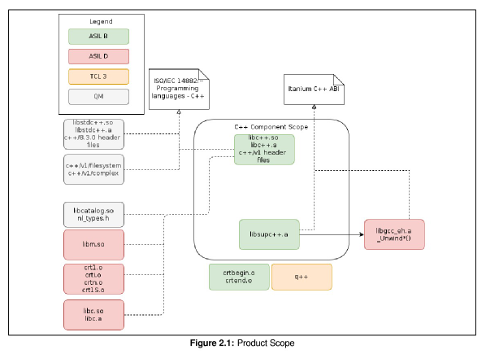

# QNX API

## Headers

### Safe Headers

[safe_headers.txt](safe_headers.txt) is derived from the [Revision List of the QNX OS for Safety (QOS) by Blackberry Limited, Certificate No.: 968/EZ 653.13/20](broken_link_v/sites/xPAD-21/Documents/10_Software/20_SW_Safety/70_PC_QNX_Blackberry/EZ_653_13_20_RL_2021_04_30_QOS_2_2_1.pdf) by stripping the prefix `target/qnx7/usr/include` from the libc header paths and `target/qnx7/usr/include/c++/v1` from the LLVM libc++ header paths.

Note: The QNX SDP also contains the GNU libstdc++ headers at `target/qnx7/usr/include/c++/8.3.0`, but GNU libstdc++ is QM and therefore not mentioned in the certificate. BMW's target C++ toolchain uses LLVM libc++, not GNU libstdc++.

For more information about the ASILs of the C++ standard library components, see the [QOS 2.2 libcxx Certified C++ Library Safety Manual](broken_link_v/sites/xPAD-21/Documents/10_Software/20_SW_Safety/70_PC_QNX_Blackberry/QMS3570-QOS2.2_libcxxSafetyManual_v5.0_2020-09-22.pdf). Figure 2.1 from this safety manual describes the product scope.



### Unsafe Headers

[unsafe_headers.txt](unsafe_headers.txt) lists all unsafe headers (i.e., headers that are not part of the certification scope). Those headers shall not be used in safe code. The file looks like this:

```
[...]
filesystem
[...]
slog2_parse.h
span
sqlite3ext.h
sqlite3.h
[...]
```

Each line lists a header file that shall not be used in safe code. This means that the following include directives are forbidden in safe code:

```cpp
#include <filesystem>
#include <slog2_parse.h>
#include <span>
#include <sqlite3ext.h>
#include <sqlite3.h>
```

### How To Update unsafe_headers.txt

To update [unsafe_headers.txt](unsafe_headers.txt) based on the latest QNX SDP, run the following command:

```sh
$ bazelisk run :gen_unsafe_headers -- --qnx_root <PATH_TO_EXTERNAL_WORKSPACE>
```

Concrete example:

```sh
$ bazelisk run :gen_unsafe_headers -- --qnx_root ~/ddad/bazel-ddad/external/xpad_qnx_sdp > unsafe_headers.txt
```

The script prints all headers from the QNX SDP at path `target/qnx7/usr/include` that are not contained in `safe_headers.txt`.

Note: The script intentionally does not print the GNU libstdc++ headers at `target/qnx7/usr/include/c++/8.3.0`, because only the LLVM libc++ headers at `target/qnx7/usr/include/c++/v1` are certified to ASIL B.

## Identifiers

### Unsafe Identifiers

[unsafe_identifiers.csv](unsafe_identifiers.csv) is derived from the [QOS safety manuals](broken_link_c/issue/3850407).
